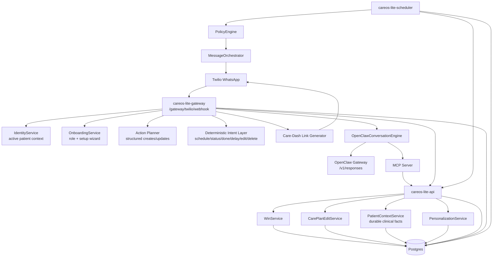

# CareOS Lite Architecture

## System Diagram

## Inbound Conversation Flow

1. Twilio sends inbound WhatsApp messages to `POST /gateway/twilio/webhook`.
2. The gateway normalizes sender identity, resolves linked participant/patient context, and runs onboarding/setup shortcuts if needed.
3. The gateway handles high-confidence operational paths first:
   - schedule/status reads
   - done/skip/delay
   - medication edit/delete
   - caregiver dashboard link requests
   - explicit durable-fact commands like `remember ...`, `facts`, and `forget ...`
4. Structured action requests flow through the planner for create/update/complete operations with confirmation.
5. Non-operational questions fall through to `OpenClawConversationEngine`.
6. OpenClaw is grounded with:
   - active medication list
   - PRN medications
   - medication-purpose hints
   - durable clinical facts
   - MCP tool hints such as `careos_get_clinical_facts`, `careos_get_medications`, `careos_get_today`, and `careos_get_status`
7. The gateway returns a TwiML message response to Twilio.

## Durable Clinical Facts

Durable clinical facts are stored separately from day-scoped personalization rules.

- Persistence: `patient_clinical_facts`
- Service: `PatientContextService`
- Internal API:
  - `POST /internal/patient-context/clinical-facts`
  - `GET /internal/patient-context/clinical-facts/active`
  - `DELETE /internal/patient-context/clinical-facts`
- WhatsApp commands:
  - `remember <key>: <fact>`
  - `remember <fact>`
  - `facts`
  - `forget <key|number>`

These facts are intended for stable patient context such as medical history, procedures, chronic conditions, and other durable facts that should shape later OpenClaw answers.

## Box Glossary

### `Twilio WhatsApp`

This is the external messaging channel used by the patient or caregiver. Twilio receives the WhatsApp message, packages it as a webhook request, and sends it into CareOS. CareOS does not talk directly to WhatsApp clients; Twilio is the transport boundary.

### `careos-lite-gateway`

This is the conversation-facing ingress service for WhatsApp at `POST /gateway/twilio/webhook`. It is responsible for:

- resolving who the sender is
- selecting the active patient context
- handling onboarding/setup shortcuts
- recognizing operational commands
- handling explicit durable-fact commands like `remember`, `facts`, and `forget`
- deciding whether a message should be handled deterministically or sent to OpenClaw

It is effectively the traffic director for inbound chat.

### `IdentityService`

This service resolves a phone number into a participant identity and linked patients. It also manages active-patient context for caregivers who are linked to more than one patient. Without this layer, the gateway would not know which patient a message like `schedule` or `done 2` refers to.

### `OnboardingService`

This service manages first-run and incomplete-account flows. It handles cases where a number is unknown, partially registered, or in a guided setup flow. In practice it powers the onboarding state machine and the persisted setup wizard for adding medications, appointments, and routines.

### `Action Planner`

This is the structured action-planning layer used for operational requests that are more complex than simple commands. For example, a message like “move my walk to tomorrow morning” is parsed into a proposed structured action, often requiring confirmation before execution. The planner is meant to keep real data changes deliberate and auditable instead of letting arbitrary free text mutate the care plan directly.

### `Deterministic Intent Layer`

This is the rule-driven operational command layer. It handles known, bounded actions such as:

- `schedule`
- `status`
- `done`, `skip`, `delay`
- medication edit/delete flows
- dashboard-link intents
- durable-fact chat commands

This layer exists so high-confidence operational actions do not depend on LLM behavior.

### `Care-Dash Link Generator`

This is the path that generates secure caregiver dashboard links when the user asks for a patient summary or dashboard view. Instead of trying to answer everything in WhatsApp, the gateway can hand off to the richer dashboard experience when the request is really for a broader management view.

### `OpenClawConversationEngine`

This is the gateway-side adapter that prepares non-operational questions for the LLM path. It builds grounded context for OpenClaw, including:

- current active medications
- PRN medications
- medication-purpose hints
- durable clinical facts
- tool hints for MCP-backed reads

It is also where fallback and retry behavior around OpenClaw HTTP calls is handled.

### `OpenClaw Gateway /v1/responses`

This is the upstream LLM-serving runtime that actually generates the conversational answer. CareOS sends a grounded request to this endpoint and receives back a user-facing response. In the current design, this is the main path for broader advisory or interpretive questions that should not be hardcoded into the gateway.

### `MCP Server`

This is the authenticated tool bridge for OpenClaw or other agents. It exposes read and write tools against CareOS through a narrow, explicit interface. The point of MCP here is to let the model ask structured questions like “get today’s medications” or “get active clinical facts” rather than relying only on prompt text.

### `careos-lite-api`

This is the main FastAPI backend. It exposes:

- patient read APIs like today/status/timeline
- care-plan editing APIs
- internal APIs used by the gateway and MCP
- patient-context APIs for durable clinical facts
- dashboard data endpoints

It is the primary application service layer behind the gateway.

### `WinService`

This is the read-model service for the patient’s usable care timeline. In CareOS, a “win” is a scheduled care event such as a medication dose, walk, BP check, meal, appointment, dressing, or symptom check.

`WinService` is responsible for turning stored care-plan state into a live timeline and status view. It does things like:

- ensure recurrence-generated instances exist
- compute the patient’s “today” view in the patient’s timezone
- return current status counts like completed/due/missed/skipped
- expose PRN medication definitions

So while the name is domain-specific, the role is basically “timeline/status read service for scheduled care events.”

### `CarePlanEditService`

This is the write-model service for safe changes to the underlying care plan. It handles:

- adding a new recurring or one-off win
- updating recurrence or metadata
- removing a win definition
- regenerating future instances
- preserving audit/version history
- deciding when active/future instances should be superseded

This service is what keeps edits consistent instead of letting raw database updates create invalid recurrence state.

### `PatientContextService`

This service manages durable patient facts that should influence later advisory answers. It is separate from reminders and separate from short-lived personalization rules. Examples include prior procedures, chronic conditions, or stable patient facts that should be visible to OpenClaw on later turns.

Its purpose is to give the system a persistent context layer that is more structured and durable than raw chat history.

### `PersonalizationService`

This service manages short-lived policy or experience adjustments, not durable medical facts. These are rules that change reminder or mediation behavior for a limited period, such as “critical only today.” It affects how CareOS behaves operationally, whereas `PatientContextService` affects how the system understands stable patient context.

### `Postgres`

Postgres is the system of record for the application. It stores:

- patient and participant identities
- care plans, definitions, and instances
- onboarding and caregiver verification state
- message events
- personalization rules
- durable clinical facts
- change/version history

Most of the other boxes are services that read from or write to this database through controlled abstractions.

### `careos-lite-scheduler`

This is the background worker that scans for due or overdue care events and decides when to send reminders or escalations. It is not handling user chat directly; instead it is responsible for time-driven outbound behavior.

### `PolicyEngine`

This component decides what kind of outbound action is appropriate for a due event. It uses things like criticality, flexibility, persona, and active rules to determine whether the system should remind, suppress, transform, or escalate.

It is the decision layer for outbound behavior.

### `MessageOrchestrator`

This component actually performs outbound messaging work after policy has decided what should happen. It is responsible for rendering/sending messages and logging them idempotently so retries do not duplicate reminders.

### `care-dash`

This is the caregiver dashboard UI. It is the richer visual surface for patient summaries, escalations, medication lists, recent events, and care management tasks that are awkward to do entirely over WhatsApp. The gateway can issue secure links into this UI when a conversation asks for a dashboard-style answer.

## Scheduler / Outbound Flow

1. `careos-lite-scheduler` polls due win instances.
2. `PolicyEngine` determines reminder/escalation behavior using criticality, flexibility, persona, and active personalization rules.
3. `MessageOrchestrator` emits outbound reminder/escalation messages.
4. Outbound events are logged idempotently in `message_events`.

## Storage Model

Postgres is the source of truth for:

- identities, memberships, caregiver links, and active patient context
- care plans, win definitions, win instances, and care-plan deltas
- onboarding sessions and caregiver verification requests
- personalization rules and mediation decisions
- durable clinical facts
- message events and reminder context

## Runtime Components

- `careos-lite-api`: FastAPI app, internal APIs, care-plan edit APIs, patient/timeline/status APIs
- `careos-lite-gateway`: Twilio mediation, deterministic command layer, structured planner, OpenClaw-first conversational path
- `careos-lite-mcp`: authenticated tool surface for OpenClaw/agents
- `careos-lite-scheduler`: reminder/escalation worker
- `care-dash`: secure caregiver dashboard linked from gateway responses

## Current Reliability Controls

- inbound dedupe keyed by `MessageSid` or deterministic fallback
- outbound idempotency for reminders and replies
- patient-local day windows resolved in patient timezone
- active-patient context selection for multi-patient caregivers
- gateway retry on transient OpenClaw `/v1/responses` transport/parse failures
- deterministic fallback when OpenClaw is unavailable

## Known Gaps

- durable facts currently support explicit capture via WhatsApp commands, not freeform extraction from arbitrary conversational turns
- durable facts are grounded for OpenClaw responses, but dashboard editing/inspection surfaces are still minimal
- long-term patient-context types beyond durable facts, such as short-lived observations and today-scoped plans, are still backlog work
