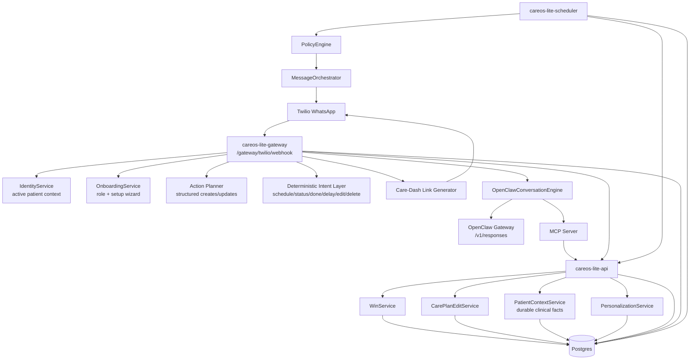

# CareOS Lite Architecture

## System Diagram

## Inbound Conversation Flow

1. Twilio sends inbound WhatsApp messages to `POST /gateway/twilio/webhook`.
2. The gateway normalizes sender identity, resolves linked participant/patient context, and runs onboarding/setup shortcuts if needed.
3. The gateway handles high-confidence operational paths first:
   - schedule/status reads
   - done/skip/delay
   - medication edit/delete
   - caregiver dashboard link requests
   - explicit durable-fact commands like `remember ...`, `facts`, and `forget ...`
4. Structured action requests flow through the planner for create/update/complete operations with confirmation.
5. Non-operational questions fall through to `OpenClawConversationEngine`.
6. OpenClaw is grounded with:
   - active medication list
   - PRN medications
   - medication-purpose hints
   - durable clinical facts
   - MCP tool hints such as `careos_get_clinical_facts`, `careos_get_medications`, `careos_get_today`, and `careos_get_status`
7. The gateway returns a TwiML message response to Twilio.

## Durable Clinical Facts

Durable clinical facts are stored separately from day-scoped personalization rules.

- Persistence: `patient_clinical_facts`
- Service: `PatientContextService`
- Internal API:
  - `POST /internal/patient-context/clinical-facts`
  - `GET /internal/patient-context/clinical-facts/active`
  - `DELETE /internal/patient-context/clinical-facts`
- WhatsApp commands:
  - `remember <key>: <fact>`
  - `remember <fact>`
  - `facts`
  - `forget <key|number>`

These facts are intended for stable patient context such as medical history, procedures, chronic conditions, and other durable facts that should shape later OpenClaw answers.

## Scheduler / Outbound Flow

1. `careos-lite-scheduler` polls due win instances.
2. `PolicyEngine` determines reminder/escalation behavior using criticality, flexibility, persona, and active personalization rules.
3. `MessageOrchestrator` emits outbound reminder/escalation messages.
4. Outbound events are logged idempotently in `message_events`.

## Storage Model

Postgres is the source of truth for:

- identities, memberships, caregiver links, and active patient context
- care plans, win definitions, win instances, and care-plan deltas
- onboarding sessions and caregiver verification requests
- personalization rules and mediation decisions
- durable clinical facts
- message events and reminder context

## Runtime Components

- `careos-lite-api`: FastAPI app, internal APIs, care-plan edit APIs, patient/timeline/status APIs
- `careos-lite-gateway`: Twilio mediation, deterministic command layer, structured planner, OpenClaw-first conversational path
- `careos-lite-mcp`: authenticated tool surface for OpenClaw/agents
- `careos-lite-scheduler`: reminder/escalation worker
- `care-dash`: secure caregiver dashboard linked from gateway responses

## Current Reliability Controls

- inbound dedupe keyed by `MessageSid` or deterministic fallback
- outbound idempotency for reminders and replies
- patient-local day windows resolved in patient timezone
- active-patient context selection for multi-patient caregivers
- gateway retry on transient OpenClaw `/v1/responses` transport/parse failures
- deterministic fallback when OpenClaw is unavailable

## Known Gaps

- durable facts currently support explicit capture via WhatsApp commands, not freeform extraction from arbitrary conversational turns
- durable facts are grounded for OpenClaw responses, but dashboard editing/inspection surfaces are still minimal
- long-term patient-context types beyond durable facts, such as short-lived observations and today-scoped plans, are still backlog work
